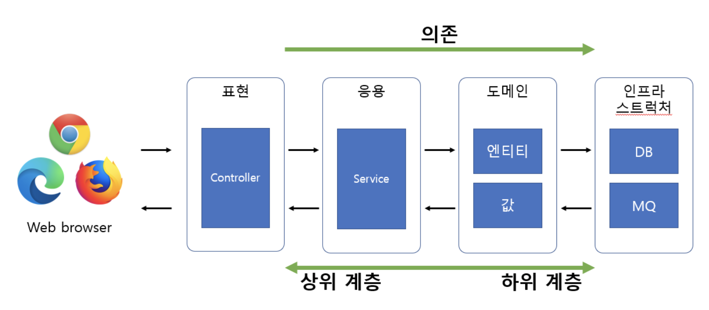
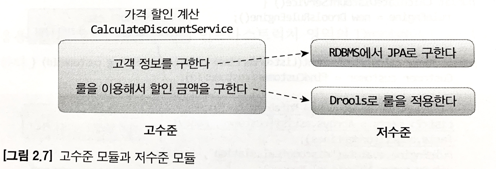
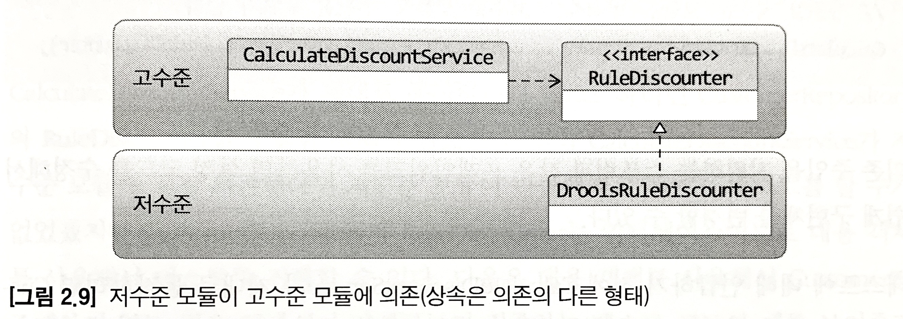

# 네 개의 영역
## Presentation 영역
* `사용자의 요청을 받아 Application 영역에 전달하고 Application 영역의 처리 결과를 다시 사용자에게 보여주는 역할`을 한다.<br>
* HTTP 요청을 Application 영역이 필요로 하는 형식으로 변환해서 Application 영역에 전달하고, Application 영역의 응답을 HTTP 응답으로 변환해서 전송한다.

## Application 영역
* Presentation 영역을 통해 사용자의 요청을 전달받아 시스템이 사용자에게 제공해야 할 기능(ex. 주문 등록/취소)을 구현한다.
* 기능을 구현하기 위해 도메인 영역의 도메인 모델을 사용한다.

주문 취소 기능을 제공하는 Application 서비스를 예로 들면 아래와 같이 주문 도메일 모델을 사용해서 기능을 구현한다.

```java
public class CancelOrderService {
    @Transactional
    public void cancelOrder(String orderId) {
        Order order = findOrderById(orderId);
        if (order == null) throw new OrderNotFoundException(orderId);
        order.cancel(); 
    }
}
```  

* Application 서비스 로직을 직접 수행하기 보다는 도메인 모델에 로직 수행을 위임한다. 위 코드도 주문 취소 로직을 직접 구현하지 않고 Order 객체에 취소 처리를 위임하고 있다.

> Application 영역은 도메인 모델을 이용해서 제공할 기능을 구현한다. 실제 도메인 로직 구현은 도메인 모델에 위임한다.

## InfraStructure 영역
* 구현 기술에 대한 것을 다룬다. RDBMS 연동, 메시징 큐에 메시지 전송/수신, MongoDB나 HBase를 사용한 DB 연동, HTTP 클라이언트를 이용해서 REST API를 호출하는 부분을 처리한다. 
* 논리적인 개념 표현보다 실제 구현을 다루는 영역이다.

Domain, Application, Presentation 영역은 구현 기술을 사용한 코드를 직접 구현하진 않는다. InfraStruture 영역에서 제공하는 기능을 사용해서 필요한 기능을 개발한다.
# 계층 구조 아키텍처
Presentation 영역과 Application 영역은 Domain 영역을 사용하고 Domain 영역은 InfraStructure 영역을 사용하므로 계층 구조를 적용하기에 적당하다. Domain의 복잡도에 따라 Application과 Domain을 분리하기도 하고 한 계층으로 합치기도 한다.

* 계층 구조는 특성상 상위에서 하위 계층으로만 의존하고 하위에서 상위 계층에 의존하지 않는다.
* 엄격하게 적용하면 상위 계층은 바로 아래의 계층에만 의존을 가져야 하지만 일반적으로 구현의 편리함을 위해 타협한다.(ex. Application -> InfraStructure 영역에 의존하기도 한다.)
* Presentation, Application, Domain 계층이 상세한 구현 기술을 다루는 InfraStructure 계층에 종속되게된다.
    * InfraStructure에 의존하게 되면 **테스트 어려움**과 **기능 확장의 어려움**이라는 두 가지 문제가 발생할 수 있다. -> `DIP`를 적용함으로써 해결할 수 있다.

* infrastructure에 의존하면서 발생되는 문제점 예시

```java
public class DroolsRuleEngine {
    private KieContainer kContainer;

    public DroolsRuleEngine() {
        KieServices ks = KieServices.Factory.get();
        KContainer = ks.getKieClasspathContainer();
    }

    public void evaluate(String sessionName, List<?> facts) {
        KieSession kSession = KContainer.newKieSession(sessionName);
        try {
            facts.forEach(x -> kSession.insert(x));
            kSession.fireAllRules();
        } finally {
            kSession.dispose();
        }
    }
}

public class CalculateDiscountService {
    private DroolsRuleEngine ruleEngine;

    public CalculateDiscountService(DroolsRuleEngine ruleEngine) {
        this.ruleEngine = new DroolsRuleEngine();
    }
    
    public Money calculateDiscount(List<OrderLine> orderLines, String customerId) {
        Customer customer = findCustomer(customerId);
        
        MutableMoney money = new MutableMoney(0);                       // Drools에
        List<?> facts = Arrays.asList(customer, money);                 // 특화된
        facts.addAll(orderLines);                                       // 코드가
        ruleEngine.evaluate("discountCalculation", facts); // 남게
        return money.toImmutableMoney();                                // 된다.
    }
}
```
"discountCalculation" 문자열은 Drools 세션 이름을 의미하는데 Drools 세션 이름 변경이 필요하게 되면 CalculateDiscountService의 코드 변경이 필요하게 된다. 

# DIP(Dependency Inversion Principle)
객체지향 5대 원칙 중 하나로, 요약 하자면 추상화에 의존해야 한다는 의미다.



* 고수준 -> 저수준 모듈을 사용하는 것이 아닌 저수준 -> 고수준 모듈을 사용하도록 해야 한다.
* 저수준 -> 고수준 모듈에 의존하기 위해 추상화한 인터페이스를 활용한다.

* ex. 



```java
public interface RuleDiscounter {
    public Money applyRules(Customer customer, List<OrderLine> orderLines);
}

public class CalculateDiscountService {
    private RuleDiscounter ruleDiscounter;

    public CalculateDiscountService(RuleDiscounter ruleDiscounter) {
        this.ruleDiscounter = ruleDiscounter;
    }

    public Money calculateDiscount(List<OrderLine> orderLines, String customerId) {
        Customer customer = findCustomer(customerId);
        return ruleDiscounter.applyRules(customer, orderLines);
    }
}

public class DroolsRuleDiscounter implements RuleDiscounter {

    private KieContainer kContainer;

    public DroolsRuleDiscounter() {
        KieContainer ks = KieServices.Factory.get();
        kContainer = ks.getKieClasspathContainer();
    }

    @Override
    public Money applyRules(Customer customer, List<OrderLine> orderLines) {
        KieSession kSession = kContainer.newKieSession("discountSession");
        try {
            //...
            kSession.fireAllRules();
        } finally {
            kSession.dispose();
        }
        return money.toImmutableMoney();
    }
}
```

# 도메인 영역의 주요 구성 요소
# 요청 처리 흐름
# 인프라스트럭처 개요
# 모듈 구조
# 참고
* https://private-space.tistory.com/92