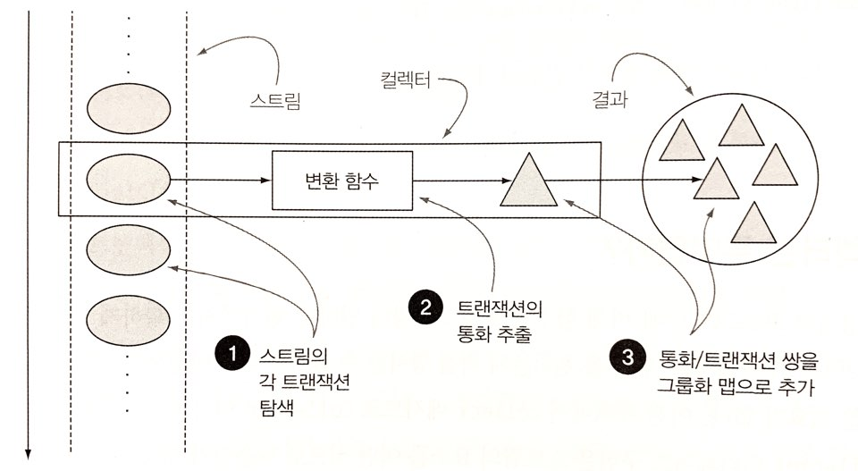
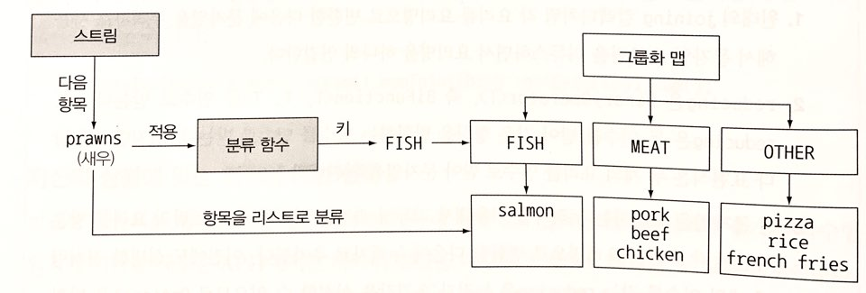
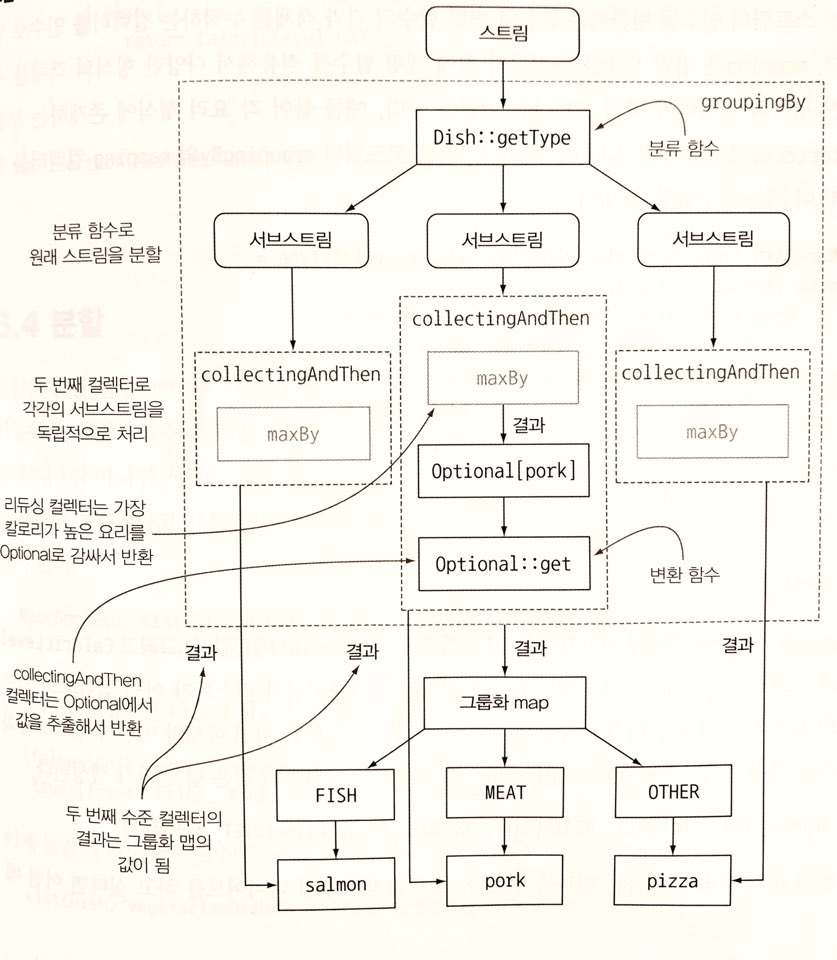
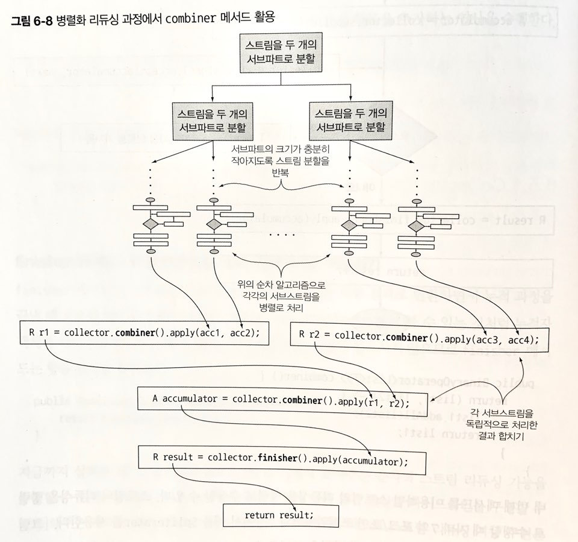

* 통화별로 트랜잭션을 그룹화
명령형 프로그래밍

```java
Map<Currency, List<Transaction>> transactionByCurrencies = new HashMap<>(); //  그룹화한 트랜잭션을 저장할 맵을 생성

for (Transactin transaction : transactions) {   //  트랜잭션 리스트를 반복
    Currency currency = transaction.getCurrency();
    List<Transaction> transactionsForCurrency = transactionsByCurrencies.get(currency);

    if (transactionForCurrency = null) {    //  현재 통화를 그룹화하는 맵에 항목이 없으면 항목을 만든다.
        transactionsForCurrency = new ArrayList<>();
        transactionsByCurrencies.put(currency, transactionsForCurrency);
    }

    transactinsForCurrency.add(transaction);    //  같은 통화를 가진 트랜잭션 리스트에 현재 탐색 중인 트랜잭션을 추가
}
``` 

함수형 프로그래밍
```java
Map<Currency, List<Transaction>> transactionsByCurrencies = transactions.stream().collect(groupingBy(Transaction::getCurrency));
```

> 함수형 프로그래밍에선 `무엇`을 원하는지 직접 명시할 수 있어서 어떤 방법으로 이를 얻을지는 신경 쓸 필요가 없다.

## 컬렉터란 무엇인가
multilevel로 그룹화를 수행할 때 명령형 코드는 가독성과 유지보수성이 크게 떨어진다. 하지만 함수형 코드는 필요한 컬렉터를 쉽게 추가할 수 있다.

### 고급 리듀싱 기능을 수행하는 컬렉터
컬렉터의 최대 강점은 collect로 결과를 수집하는 과정을 간단하면서도 유연한 방식으로 정의할 수 있다는 점이다.<br>
즉, 스트림에 collect를 호출하면 스트림의 요소에 컬렉터로 파라미터화된 리듀싱 연산이 수행된다. collect에서는 리듀싱 연산을 이용해서 스트림의 각 요소를 방문하면서 컬렉터가 작업을 처리한다.<br>

보통 함수를 요소로 변환할 때는 컬렉터를 적용하며 최종 결과를 저장하는 자료구조에 값을 누적한다.<br>
즉, Collector 인터페이스의 메서드를 어떻게 구현하느냐에 따라 스트림에 어떤 리듀싱 연산을 수행할 지 결정된다.

### 미리 정의된 컬렉터
groupingBy와 같이 Collectors 클래스에서 제공하는 팩토리 메서드의 기능을 설명한다. 이를 미리 정의된 컬렉터라 표현한다.
* Collectors에서 제공하는 메서드의 기능
    * 스트림 요소를 하나의 값으로 리듀스하고 요약
    * 요소 그룹화
    * 요소 분할

## 리듀싱과 요약
Collector 팩토리 클래스로 만든 컬렉터 인스턴스로 무엇을 할 수 있을까.
* 개수 카운팅

```java
long howManyDishes = menu.stream().collect(Collectors.counting());

long howManyDishes = menu.stream().count();     //  위에서 더 간소화
```

### 스트림값에서 최댓값과 최솟값 검색
`Collectors.maxBy`, `Collectors.minBy` 두 개의 메서드로 `스트림의 최댓값, 최솟값을 계산`할 수 있다.<br>

### 요약 연산
스트림에 있는 `객체의 숫자 필드의 합계나 평균 등을 반환하는 연산`에도 리듀싱 기능이 자주 사용된다. 이러한 연산을 요약(summarization) 연산이라 부른다.
Collectors 클래스는 `Collectors.summingInt`라는 특별한 요약 팩토리 메서드를 제공한다.
```java
int totalCalories = menu.stream().collect(summingInt(Dish::getCalories));   //  메뉴 리스트의 총 칼로리의 합을 계산한다.
```

> menu.stream().map(Dish::getCalories).reduce(0, Integer::sum)와의 차이는?

* summingInt 컬렉터의 누적 과정

칼로리로 매핑된 각 요리의 값을 탐색하면서 초깃값(0)으로 설정되어 있는 누적자에 칼로리를 더한다.

Collectors.averagingInt/Long/Double 으로 평균값 계산과 같은 요약 기능을 활용할 수 있다.
```java
double avgCalories = menu.stream().collect(averagingInt(Dish::getCalories));
```

또한, `두 개 이상의 연산을 한번에 수행해야 될 때`는 팩토리 메서드 `summarizingInt`가 반환하는 컬렉터를 사용할 수 있다.
```java
IntSummaryStatistics menuStatistics = menu.stream().collect(summarizingInt(Dish::getCalories));

// 결과값 IntSummaryStatistics{count=9, sum=4200, min=120, average=466.666667, max=800}
```
위와 같이 메뉴에 있는 요소의 수, 칼로리 합계, 평균, 최댓값, 최솟값을 한 번에 계산할 수 있다.

### 문자열 연결
컬렉터의 `joining` 팩토리 메서드를 이용하면` 스트림의 각 객체에 toString 메서드를 호출해서 추출한 모든 문자열을 하나의 문자열로 연결`해서 반환한다.
```java
String shortMenu = menu.stream().map(Dish::getName).collect(joining());
```
Dish 클래스에 name을 반환하는 toString 메서드를 포함하고 있다면 map처리과정을 생략할 수 있다.

> joining 메서드는 내부적으로 `StringBuilder`를 이용해서 문자열을 하나로 만든다.

### 범용 리듀싱 요약 연산
위의 모든 요약 연산들은 reducing 팩토리 메서드로도 구현할 수 있다. 위 처럼 특화된 팩토리 메서드를 사용한 이유는 프로그래밍적 편의성 때문이다.

* reducing 메서드를 활용한 칼로리 합계

```java
int totalCalories = menu.stream().collect(reducing(0, Dish::getCalories, (i, j) -> i + j));
```

reducing은 3개의 인수를 받는다.
* 0 : 리듀싱 연산의 시작값 혹은 스트림에 인수가 없을 때 반환 값
* Dish::getCalories : 변환 함수
* (i, j) -> i + j : 같은 종류의 두 항목을 하나의 값으로 더하는 BinaryOperator이다.

한 개의 인수를 받는 reducing 컬렉터는 시작값이 없으므로 빈 스트림이 넘겨졌을 때, 시작값이 설정되지 않게되므로 Optional<> 객체를 반환하게 된다.

> collect vs reduce
> collect 메서드 : 도출하려는 결과를 누적하는 컨테이너를 바꾸도록 설계된 메서드
> reduce 메서드 : 두 값을 하나로 도출하는 불변형 연산. 따라서 누적 연산으로 활용하게 되면 의미론적으로 잘못 사용한 것이다.

#### 컬렉션 프레임워크 유연성 : 같은 연산도 다양한 방식으로 수행할 수 있다.
```java
int totalCalories = menu.stream().collect(reducing(0,       //  초깃값
                                          Dish::getCalories, // 변환 함수
                                          Integer::sum));   //  합계 함수
``` 
이전 예제의 람다 표현식 대신 Integer 클래스의 sum 메서드 레퍼런스를 활용하면 코드를 더 단순화 시킬 수 있다.
counting 컬렉터도 3개의 인수를 갖는 reducing 팩토리 메서드를 이용해서 구현할 수 있다.
```java
public static <T> Collector<T, ?, Long> counting() {
    return reducing(0L, e -> 1L, Long::sum);
}
```
스트림의 Long 객체 형식의 요소를 1로 변환한 다음에 모두 더할 수 있다.

> 제네릭 와일드 카드 ? 사용법
> 위 예제에서 ?는 컬렉터의 누적자 형식이 알려지지 않았음을, 즉 누적자의 형식이 자유로움을 의미한다.

한 개의 인수를 갖는 reduce 스트림과 같이 reduce(Integer:sum)도 빈 스트림과 같은 문제를 피할 수 있도록 Optional<Integer>를 반환한다.

#### 자신의 상황에 맞는 최적의 방법 선택
스트림 인터페이스에서 직접 제공하는 메서드를 이용하는 것 보다 컬렉터를 이용하는 코드가 더 복잡한 경우를 알 수 있었다. 대신, 재사용성과 커스터마이즈 기능을 통해 추상화와 일반화를 얻을 수 있었다.

## 그룹화
데이터 집합을 그룹화할 때도 명령형으로 처리하게 되면 가독성도 떨어지고 에러도 많이 발생된다. 함수형을 이용하면 가독성도 좋고 한 줄의 코드로 그룹화를 구현할 수 있다.
```java
Map<Dish.Type, List<Dish>> dishesByType = menu.stream().collect(groupingBy(Dish::getType));

//  결과 : {MEAT=[pork, beef, chicken], FISH=[prawns, salmon], OTHER=[french fries, rice, season fruit, pizza]}
```
스트림의 각 요리에서 Dish.Type과 일치하는 모든 요리를 추출하는 함수를 groupingBy 메서드로 전달했다. 이 함수를 기준으로 스트림이 그룹화되므로 이를 `분류 함수(classification function)`라고 한다.

그룹화 연산의 결과로 그룹화 함수가 반환하는 키, 그리고 각 키에 대응하는 스트림의 모든 항목 리스트를 값으로 갖는 맵이 반환된다.<br>
단순한 속성 접근자 대신 복잡한 분류 기준이 필요할 때는 메서드 레퍼런스 대신 람다 표현식으로 필요한 로직을 구현할 수 있다.
```java
public enum CaloricLevel { DIET, NORMAL, FAT }

Map<CaloricLevel, List<Dish>> dishesByCaloricLevel 
    = menu.stream()
          .collect(groupingBy(dish -> {
                if (dish.getCalories() <= 400) {
                    return CaloricLevel.DIET;
                } else if (dish.getCalories() <= 700) {
                    return CaloricLevel.NORMAL;
                } else {
                    return CaloricLevel.FAT;
                }
          }
```

### 다수준 그룹화
다수준 그룹화란 두 가지 기준을 동시에 그룹화할 수 있는 기능이다. 두 인수를 받는 팩토리 메서드 Collectors.groupingBy를 이용해서 항목을 다수준으로 그룹화 할 수 있다.<br>
바깥쪽 groupingBy 메서드에 스트림의 항목을 분류할 두 번째 기준을 정의하는 내부 groupingBy를 전달해서 두 수준으로 스트림의 항목을 그룹화할 수 있다.
```java
Map<Dish.Type, Map<CaloricLevel, List<Dish>>> dishesByTypeCaloricLevel = 
    menu.stream().collect(
        groupingBy(Dish::getType,
            groupingBy(dish -> {
                if (dish.getCalories() <= 400) {
                    return CaloricLevel.DIET;
                } else if (dish.getCalories() <= 700) {
                    return CaloricLevel.NORMAL;
                } else {
                    return CaloricLevel.FAT;
                }
            })
        )
    );

/* 결과 : {
          OTHER={DIET=[rice, season fruit], NORMAL=[french fries, pizza]}, 
          FISH={DIET=[prawns], NORMAL=[salmon]}, 
          MEAT={DIET=[chicken], FAT=[pork], NORMAL=[beef]}
         }
*/
```
### 서브그룹으로 데이터 수집
분류 함수 한 개의 인수를 갖는 groupingBy(f)는 사실 groupingBy(f, toList())의 축약형이다.<br>
따라서 요리의 종류를 분류하는 컬렉터로 메뉴에서 가장 높은 칼로리를 가진 요리를 찾는 로직도 구현할 수 있다.
```java
Map<Dish.Type, Optional<Dish>> mostCaloricByType = 
    menu.stream().collect(groupingBy(Dish::getType, maxBy(comparingInt(Dish::getCalories))));

//  결과 : {OTHER=Optional[pizza], MEAT=Optional[pork], FISH=Optional[salmon]}
```
#### 컬렉터 결과를 다른 형식에 적용하기
마지막 그룹화 연산은 Optional.empty()를 값으로 가질 수 없기 때문에 Optional로 감쌀 필요가 없다. groupingBy 컬렉터는 스트림의 첫 번째 요소를 찾은 이후에야 그룹화 맵에 새로운 키를 추가하기 때문에 굳이 Optional 래퍼를 사용할 필요가 없다.<br>
즉, `팩토리 메서드 Collectors.collectingAndThen으로 컬렉터가 반환한 결과를 다른 형식으로 활용`할 수 있다.
```java
Map<Dish.Type, Dish> mostCaloricByType =
    menu.stream()
        .collect(groupingBy(Dish::getType,  //  분류함수
                 collectingAndThen(maxBy(comparingInt(Dish::getCalories)),  //  감싸인 컬렉터
                 Optional::get)));  //  변환함수. Optional에 포함된 값을 추출
```
팩토리 메서드 collectingAndThen은 적용할 컬렉터와 변환함수를 인수로 받아 다른 컬렉터를 반환한다. 반환되는 컬렉터는 기존 컬렉터의 래퍼 역할을 하며 collect의 마지막 과정에서 변환함수로 자신이 반환하는 값을 매핑한다.<br>
리듀싱 컬렉터(ex. counting, maxBy, minBy 등)은 절대 Optional.empty()를 반환하지 않는다.


> 왜 collectionAndThen으로 maxBy를 감싼 결과는 Optional 객체에 감싸진 결과가 나오는 걸까?
> 초기값이 없이 람다식으로만 이뤄진 범용 리듀싱의 경우 변환값이 Optional로 반환되게 된다.
> 스트림에 있는 객체의 숫자 필드의 합계나 평균등을 반환하는 연산에도 리듀싱 기능이 사용된다.

#### groupingBy와 함께 사용하는 다른 컬렉터 예제
일반적으로 스트림에서 같은 그룹으로 분류된 모든 요소에 리듀싱 작업을 수행할 때는 팩토리 메서드 groupingBy에 두 번째 인수로 전달한 컬렉터를 사용한다.<br>
* mapping 메서드

```java
Map<Dish.Type, Set<CaloricLevel>> caloricLevelByType = 
    menu.stream().collect(
        groupingBy(Dish::getType, mapping(dish -> {
            if (dish.getCalories() <= 400) {
                return CaloricLevel.DIET;
            } else if (dish.getCalories() <= 700) {
                return CaloricLevel.NORMAL;
            } else {
                return CaloricLevel.FAT;
            }
        }, toSet()))
    );

// 결과 : {OTHER=[DIET, NORMAL], FISH=[DIET, NORMAL], MEAT=[DIET, FAT, NORMAL]}
```
mapping 메서드는 스트림의 인수를 변환하는 함수와 변환 함수의 결과 객체를 누적하는 컬렉터를 인수로 받는다. mapping은 입력 요소를 누적하기 전에 매핑 함수를 적용해서 다양한 형식의 객체를 주어진 형식의 컬렉터에 맞게 변환한다.<br>
위 소스에서 Set의 형식이 정해져 있지 않았던 것을 `toCollection`을 활용하면 원하는 방식으로 결과를 제어할 수 있다.
```java
Map<Dish.Type, Set<CaloricLevel>> caloricLevelByType = 
    menu.stream().collect(
        groupingBy(Dish::getType, mapping(dish -> {
            if (dish.getCalories() <= 400) {
                return CaloricLevel.DIET;
            } else if (dish.getCalories() <= 700) {
                return CaloricLevel.NORMAL;
            } else {
                return CaloricLevel.FAT;
            }
        }, toCollection(HashSet::new)))
    );

// 결과 : {MEAT=[FAT, NORMAL, DIET], OTHER=[NORMAL, DIET], FISH=[NORMAL, DIET]}
```

## 분할
분할은 분할 함수(Partitioning Function)라 불리는 predicate를 분류 함수로 사용하는 특수한 그룹화 기능이다. 분할 함수는 boolean을 반환한다. 결과적으로 그룹화 맵은 최대 두 개의 그룹을 갖는다.
```java
Map<Boolean, List<Dish>> partitionedMenu = menu.stream().collect(partitioningBy(Dish::isVegetarian));

// 결과 : {false=[pork, beef, chicken, prawns, salmon], true=[french fries, rice, season fruit, pizza]}
```
```java
List<Dish> vegetarianDishes = parationedMenu.get(true);

// menu.stream().filter(Dish::isVegetarian).collect(toList()) 와 결과는 같음.

//  결과 : [french fries, rice, season fruit, pizza] 채식 요리만 출력
```
### 분할의 장점
분할 함수를 사용함으로써 참, 거짓 두 가지 요소의 스트림 리스트를 모두 유지한다는 것이 장점이다. 또한 컬렉터를 두 번째 인수로 전달할 수 있는 오버로드된 버전의 partitioningBy 메서드도 있다.
```java
Map<Boolean, Map<Dish.Type, List<Dish>>> vegetarianDishesByType
    = menu.stream().collect(partitioningBy(Dish::isVegetarian,  //  분할 함수
                                            groupingBy(Dish::getType)));    //  두 번째 컬렉터

// 결과 : {
            false={MEAT=[pork, beef, chicken], FISH=[prawns, salmon]}, 
            true={OTHER=[french fries, rice, season fruit, pizza]}
         }
```
채식 요리의 스트림과 채식이 아닌 요리의 스트림을 각각 요리 종류로 그룹화하여 두 수준의 맵이 반환되었다.

> 퀴즈 : 결과 예측하기
> 1. menu.stream().collect(partitioningBy(Dish::isVegetarian, partitioningBy(d -> d.getCalories() > 500)));
> 2. menu.stream().collect(partitioningBy(Dish::isVegetarian, partitioningBy(Dish::getType)));
> 3. menu.stream().collect(partitioningBy(Dish::isVegetarian, counting()));

### 숫자를 소수와 비소수로 분할하기
* predicate 활용

```java
public boolean isPrime(int candidate) {
    return IntStream.range(2, candidate)        //  2부터 candidate 미만 사이의 자연수를 생성
                    .noneMatch(i -> candidate % 1 == 0);    //  스트림의 모든 정수로 candidate를 나눌 수 없으면 참을 반환
}
```
이제 isPrime메서드와 predicate를 이용하고 partitionBy 컬렉터로 리듀스하여 숫자를 소수와 비소수로 분류할 수 있다.
```java
public Map<Boolean, List<Integer>> partitionPrimes(int n) {
    return Intstream.rangeClosed(2, n).boxed().collect(partitioningBy(candidate -> isPrime(candidiate)));
}
```

* Collectors 클래스의 정적 팩토리 메서드

<table>
       <thead>
           <tr>
               <th>팩토리 메서드</th>
               <th>반환 형식</th>
               <th>사용 예제</th>
           </tr>
       </thead>
       <tbody>
           <tr>
               <td>toList</td>
               <td>List< T ></td>
               <td>스트림의 모든 항목을 리스트로 수집</td>
           </tr>
           <tr>
               <td colspan="3">List< Dish > dishes = menuStream.collect(toList());</td>
           </tr>
           <tr>
               <td>toSet</td>
               <td>Set< T ></td>
               <td>스트림의 모든 항목을 중복이 없는 집합으로 수집</td>
           </tr>
           <tr>
               <td colspan="3">Set< Dish > dishes = menuStream.collect(toSet());</td>
           </tr>
           <tr>
               <td>toCollection</td>
               <td>Collection< T ></td>
               <td>스트림의 모든 항목을 공급자가 제공하는 컬렉션으로 수집</td>
           </tr>
           <tr>
               <td colspan="3">Collection< Dish > dishes = menuStream.collect(Collection(), ArrayList::new);</td>
           </tr>
           <tr>
               <td>counting</td>
               <td>Long</td>
               <td>스트림의 항목 수 계산</td>
           </tr>
           <tr>
               <td colspan="3">long howManyDishes = menuStream.collect(counting());</td>
           </tr>
           <tr>
               <td>summingInt</td>
               <td>Integer</td>
               <td>스트림의 항목에서 정수 프로퍼티 값을 더함</td>
           </tr>
           <tr>
               <td colspan="3">int totalCalories dishes = menuStream.collect(summingInt(Dish::getCalories));</td>
           </tr>
           <tr>
               <td>averageingInt</td>
               <td>Double< T ></td>
               <td>스트림 항목의 정수 프로퍼트의 평균 값 계산</td>
           </tr>
           <tr>
               <td colspan="3">double avgCalories = menuStream.collect(averagingInt(Dish::getCalories));</td>
           </tr>
           <tr>
               <td>summarizingInt</td>
               <td>IntSummaryStatistics</td>
               <td>스트림 내의 항목의 최댓값, 최솟값, 합계, 평균 등의 정수 정보 통계를 수집</td>
           </tr>
           <tr>
               <td colspan="3">
               IntSummaryStatistics menuStatistics = menuStream.collect(summarizingInt(Dish::getCalories));<br>
               결과 : IntSummaryStatistics{count=9, sum=4200, min=120, average=466.666667, max=800}
               </td>
           </tr>
           <tr>
               <td>joining</td>
               <td>String</td>
               <td>스트림의 각 항목에 toString 메서드를 호출한 결과 문자열을 연결</td>
           </tr>
           <tr>
               <td colspan="3">String shortMenu = menuStream.map(Dish::getName).collect(joining(", "));</td>
           </tr>
           <tr>
               <td>maxBy, minBy</td>
               <td>Optional< T ></td>
               <td>주어진 비교자를 이용해서 스트림의 최댓값/최솟값 요소를 Optional로 감싼 값을 반환, 스트림에 요소가 없을 때는 Optional.empty()를 반환.</td>
           </tr>
           <tr>
               <td colspan="3">Optional< Dish > fattest = menuStream.collect(maxBy(comparingInt(Dish::getCalories)));</td>
           </tr>
           <tr>
               <td>reducing</td>
               <td>리듀싱 연산에서 형식을 결정</td>
               <td>누적자를 초깃값으로 설정한 다음 BinaryOperator로 스트림의 각 요소를 반복적으로 누적자와 합쳐 스트림을 하나의 값으로 리듀싱</td>
           </tr>
           <tr>
               <td colspan="3">int totalCalories = menuStream.collect(reducing(0, Dish::getCalories, Integer::sum));</td>
           </tr>
           <tr>
               <td>collectingAndThen</td>
               <td>변환 함수가 형식을 반환</td>
               <td>다른 컬렉터를 감싸고 그 결과에 변환 함수를 적용</td>
           </tr>
           <tr>
               <td colspan="3">int howManyDishes = menuStream.collect(collectingAndThen(toList(), List::size));</td>
           </tr>
           <tr>
               <td>groupingBy</td>
               <td>Map< K, List< T >></td>
               <td>하나의 프로퍼티 값을 기준으로 스트림의 항목을 그룹화하며 기준 프로퍼티 값을 결과 맵의 키로 사용</td>
           </tr>
           <tr>
               <td colspan="3">Map< Dish.Type, List< Dish > dishesByType = menuStream.collect(groupingBy(Dish::getType));</td>
           </tr>
           <tr>
               <td>partitioningBy</td>
               <td>Map< Boolean, List< T >></td>
               <td>predicate를 스트림의 각 항목에 적용한 결과로 항목을 분할. </td>
           </tr>
           <tr>
               <td colspan="3">Map< Boolean, List< Dish > vegetarianDishes = menuStream.collect(partitioningBy(Dish::isVegetarian));</td>
           </tr>         
       </tbody>
</table>

## Collector 인터페이스
Collector 인터페이스는 리듀싱 연산(컬렉터)을 어떻게 구현할 지 제공하는 메서드 집합으로 구성된다. 여기서 Collector 인터페이스를 직접 구현해서 소수 분류 문제 혹은 더 효율적으로 문제를 해결할 수 있는 컬렉터를 만들 수 있다.

* Collector 인터페이스

```java
public interface Collector<T, A, R> {
    Supplier<A> supplier();
    BiConsumer<A, T> accumulator();
    Function<A, R> finisher();
    BinaryOperator<A> combiner();
    Set<Characteristics> characteristics();
}
```

Collector 인터페이스의 시그니처와 5개의 메서드 정의이다. 위 코드는 다음처럼 설명될 수 있다.
* T는 수집될 스트림 항목의 제네릭 형식이다.
* A는 누적자, 즉 수집 과정에서 중간 결과를 누적하는 객체의 형식이다.
* R은 수집 연산 결과 객체의 형식이다.

### Collector 인터페이스의 메서드
#### supplier 메서드 : 새로운 결과 컨테이너 만들기
supplier 메서드는 빈 결과로 이루어진 Supplier를 반환해야 한다. 즉, supplier는 수집 과정에서 빈 누적자 인스턴스를 만드는 파라미터가 없는 함수다.
```java
public Supplier<List<T>> supplier() {
    return () -> new ArrayList<T>();
}
public Supplier<List<T>> supplier() {
    return ArrayList::new;
}
```
위 처럼 빈 리스트 혹은 생성자 레퍼런스를 전달한다.
#### accumulator 메서드 : 결과 컨테이너에 요소 추가하기
accumulator 메서드는 리듀싱 연산을 수행하는 함수를 반환한다.<br>
누적자와 새로운 요소를 함수에 적용한다. 반환 값은 void로, 즉 요소를 탐색하면서 적용하는 함수에 의해 누적자 내부 상태가 바뀌므로 누적자가 어떤 값일지 단정할 수 없다.
```java
public BiConsumer<List<T>, T> accumulator() {
    return (list, item) -> list.add(item);
}
public BiConsumer(List<T>, T> accumulator() {
    return List::add;
}
```
#### finisher 메서드 : 최종 변환 값을 결과 컨테이너로 적용하기
finisher 메서드는 스트림 탐색을 끝내고 누적자 객체를 최종 결과로 변환하면서 누적 과정을 끝낼 때 호출할 함수를 반환해야 한다.<br>
때로 누적자 객체가 이미 최종 결과인 상황도 있는데 이럴 때는 변환 과정이 필요하지 않으므로 finisher 메서드는 항등 함수를 반환한다.
```java
public Function<List<T>, List<T>> finisher() {
    return Function.identity();
}
``` 

> 위 3가지 메소드는 `순차적 스트림 리듀싱 기능`을 수행할 수 있다. 실제로 collect가 동작하기 전, 다른 중간 연산과 파이프라인을 구성할 수 있게 해주는 게으른 특성 그리고 병렬 실행 등도 고려해야 하므로 스트림 리듀싱 기능 구현은 생각보다 복잡하다.


#### combiner 메서드 : 두 결과 컨테이너 병합
combiner는 리듀싱 연산에서 사용할 함수를 반환하는 메서드이다.<br>
스트림의 서로 다른 서브파트를 병렬로 처리할 때 누적자가 이 결과를 어떻게 처리할 지 정의한다.
```java
public BinaryOperator<List<T>> combiner() {
    return (list1, list2) -> {
        list1.addAll(list2);
        return list1;
    }
}
```
스트림의 두 번째 서브파트에서 수집한 항목 리스트를 첫 번째 서브파트 결과 리스트의 뒤에 추가한다.

combiner 메서드를 이용하면 스트림의 리듀싱을 병렬로 수행할 수 있다. 이 때 자바7의 포크/조인 프레임워크와 Spliterator를 사용한다.

1. 스트림의 분할을 정의하는 조건이 성립할 경우 원래 스트림을 재귀적으로 분할한다.(분산된 작업의 크기가 너무 작아지면 병렬 수행의 속도는 순차 수행의 속도보다 느려진다. 따라서 프로세싱 코어의 개수를 초과하는 병렬작업은 효율이 좋지 않다.)
2. 서브스트림의 각 요소에 리듀싱 연산을 순차적으로 적용하여 서브스트림을 병렬로 처리한다.
3. combiner 메서드가 반환하는 함수를 통해 각 서브스트림의 결과를 합쳐 연산을 완료한다.

#### Characteristics 메서드
Characteristics 메서드는 컬렉터의 연산을 정의하는 Charactieristics 형식의 불변 집합을 반환한다.<br>
Characteristics는 스트림을 병렬로 리듀스할건지, 그리고 병렬로 리듀스한다면 어떤 최적화를 선택해야 할지 힌트를 제공한다.<br>
Characteristics는 다음 세 항목의 특성을 갖는 열거형이다.
* UNORDERED

리듀싱 결과는 스트림의 방문 순서나 누적 순서에 영향을 받지 않는다.
* CONCURRENT

다중 스레드에서 accumulator 함수를 동시에 호출할 수 있으며 이 컬렉터는 스트림의 병렬 리듀싱을 수행할 수 있다.<br>
컬렉터의 플래그에 UNORDERED를 함께 설정하지 않았다면 데이터 소스가 정렬되어 있지 않은(집합처럼 요소의 순서가 무의미한) 상황에서만 병렬 리듀싱을 수행할 수 있다.
* IDENTITY_FINISH

finisher 메서드가 반환하는 함수는 identity를 적용할 뿐이므로 이를 생략할 수 있다. 따라서 리듀싱 과정의 최종 결과로 누적자 객체를 바로 사용할 수 있다.<br>
또한 누적자 A를 결과 R로 안전하게 형변환 할 수 있다.
### 응용
```java
import java.util.ArrayList;
import java.util.Collections;
import java.util.EnumSet;
import java.util.List;
import java.util.Set;
import java.util.function.BiConsumer;
import java.util.function.BinaryOperator;
import java.util.function.Function;
import java.util.function.Supplier;
import java.util.stream.Collector;

import static java.util.stream.Collector.Characteristics.CONCURRENT;
import static java.util.stream.Collector.Characteristics.IDENTITY_FINISH;

public class ToListCollector<T> implements Collector<T, List<T>, List<T>> {
    @Override
    public Supplier<List<T>> supplier() {
        return ArrayList::new;              //  수집 연산의 시발점
    }
    @Override
    public BiConsumer<List<T>, T> accumulator() {
        return List::add;                   //  탐색한 항목을 누적하고 바로 누적자를 변경
    }
    @Override
    public Function<List<T>, List<T>> finisher() {
        return Function.identity();         //  항등 함수
    }
    @Override
    public BinaryOperator<List<T>> combiner() {
        return (list1, list2) -> {
            list1.addAll(list2);            //  두 번째 컨텐츠와 합쳐서 첫 번째 누적자를 변경
            return list1;                   //  변경된 첫 번째 누적자를 반환
        };
    }
    @Override
    public Set<Characteristics> characteristics() {
        return Collections.unmodifiableSet(
                EnumSet.of(IDENTITY_FINISH, CONCURRENT));   //  컬렉터의 플래그를 IDENTITY_FINISH, CONCURRENT로 설정
    }
}
```
```java
List<Dish> dishes = menu.stream().collect(new ToListCollector<Dish>());

// 기존 코드 List<Dish> dishes = menu.stream().collect(toList());
```
위 코드를 통해 기존 자바에서 제공하는 API대신 우리가 만든 컬렉터를 메뉴 스트림의 모든 요리를 수집하는 예제에 사용할 수 있다.<br>
기존 코드의 toList는 팩토리지만 ToListCollector는 new로 인스턴스화한다는 점이 다르다.
### 컬렉터 구현 없이 커스텀 수집 수행하기
```java
List<Dish> dishes = menu.stream().collect(
                            ArrayList::new,     //  supplier 
                            List::add,          //  accumulator
                            List::addAll);      //  combiner
```
위 처럼 Stream은 세 함수(supplier, accumulator, combiner)를 인수로 받아 Collector 인터페이스의 메서드가 반환하는 함수와 같은 기능을 수행할 수 있다.<br>
다만, 한계점이 있다면 이전 코드에 비해 간결하고 축약돼있지만 가독성은 떨어진다. 따라서 `적절한 클래스로 커스텀 컬렉터를 구현하는 것이 중복을 피하고 재사용성을 높일 수 있다.`<br>
또한, 두 번째 collect 메서드로는 Characteristics를 전달할 수 없다. 때문에 커스텀 컬렉터를 구현하여 해결할 수 있는 방법을 찾아야 한다.
## 커스텀 컬렉터를 구현하여 성능 개선
### 소수로만 나누기
1. Collector 클래스 시그니처 정의
2. 리듀싱 연산 구현
3. 병렬 실행할 수 있는 컬렉터 만들기
4. finisher 메서드와 컬렉터의 characteristics 메서드

## 요약
* collect는 스트림의 요소를 요약 결과로 누적하는 다양한 방법(컬렉터라 불리는)을 인수로 갖는 최종 연산이다.
* 스트림의 요소를 하나의 값으로 리듀스하고 요약하는 컬렉터뿐 아니라 최솟값, 최댓값, 평균값을 계산하는 컬렉터 등이 미리 정의되어 있다.
* 미리 정의된 컬렉터인 groupingBy로 스트림의 요소를 그룹화하거나, partitioningBy로 스트림의 요소를 분할할 수 있다.
* 컬렉터는 다수준의 그룹화, 분할, 리듀싱 연산이 가능하다.
* Collector 인터페이스에 정의된 메서드를 구현하여 커스텀 컬렉터를 개발할 수 있다.
