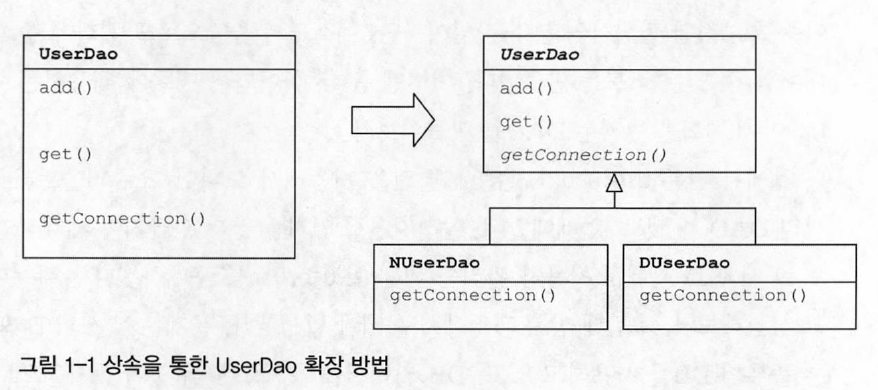
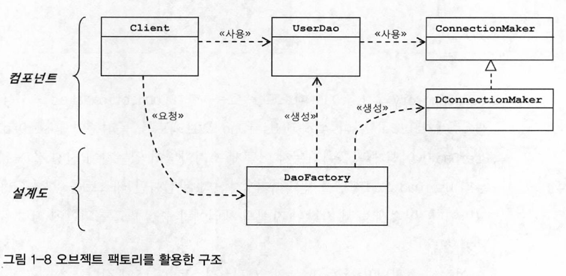
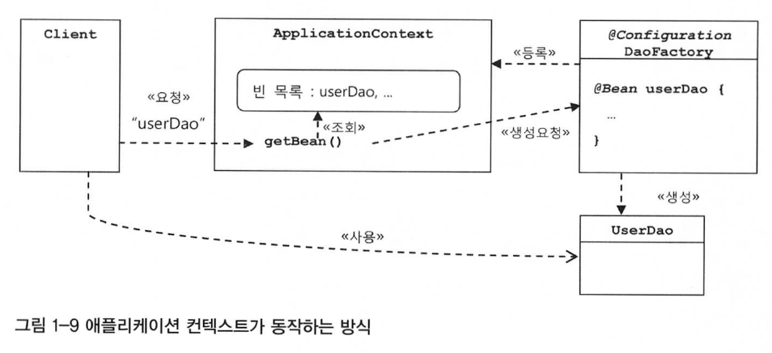

> DAO란 DB를 사용해 데이터를 조회하거나 조작하는 기능을 전담하도록 만든 오브젝트

# 초난감 DAO의 분리
## 관심사의 분리
관심사의 분리란 객체지향적으로 이야기해보면 관심이 같은 것끼리는 하나의 객체 안으로 또는 친한 객체로 모이게 하고, 관심이 다른 것은 가능한 한 따로 떨어져서 서로 영향을 주지 않도록 분리하는 것을 말한다.<ㅠr>
쉽게 말해 관심이 같은 것끼리 모으고 관심이 다른 것은 따로 떨어져 있게 하는 것이다. 관심사가 같은 것끼리 모으고 다른 것은 분리해줌으로써 같은 관심에 효과적으로 집중할 수 있게 된다.
## 중복 메소드의 추출. 리팩토링
책에서 예로 든 DB 커넥션을 가져오는 코드가 여럿 중복되어 있다는 것은 앞에서 말한 DB 연결이라는 관심사가 여기저기 흩어있음을 의미한다. 이는 곳 유지보수 및 변경사항이 발생될 때 큰 어려움을 야기시킨다.<br>
### 중복 코드의 메소드 추출
중복된 코드를 추출함으로써 관심의 종류에 따라 코드를 구분하도록 했기 때문에 한 가지 관심에 대한 변경이 일어날 경우, 그 관심에 집중되는 부분의 코드만 수정하면 된다.<br>
즉, 관심 내용이 독립적으로 존재하므로 수정도 간단해진다.
### 변경사항의 검증: 리팩토링과 테스트
중복된 코드를 추출하도록 코드를 수정했으므로 기능에 이상이 없는지 테스트가 필요하다. 작업의 기능에는 변화가 없으면서 구조만 변경하는 작업을 `리팩토링`이라 한다.
## 커넥션 독립: 상속을 통한 확장
같은 DAO 객체를 사용자 입맛에 맞게 유연하게 적용하기 위한 방법 중 하나로 `상속을 통한 확장`이 있다.

```java
public abstract class UserDao {
    public void add(User user) throws ClassNotFoundException, SQLException {
        Connection c = getConnection();
        ...
    }

    public void get(String id) throws ClassNotFoundException, SQLException {
        Connection c = getConnection();
        ...
    }    

    //  구현 코드는 제거되고 추상 메소드로 바뀜으로써 구현은 서브클래스가 맡는다.
    public abstract Connection getConnection() throws ClassNotFoundException, SQLException;
}
```


사진처럼 UserDao 클래스를 추상클래스로 만들고, 각 사용자들은 자신의 입맛에 맞게 UserDao 클래스를 상속받아 서브클래스 형태로 원하는 형식으로 구현할 수 있다.<br>
이제 UserDao 클래스는 단순히 변경이 용이한 수준을 넘어 확장이 가능해진다.<br>
이렇게 슈퍼클래스에 기본적인 로직의 흐름을 만들고 그 기능의 일부를 추상 메소드나 오버라이딩이 가능한 protected 메소드 등으로 만든 뒤 서브클래스에서 이런 메소드를 필요에 맞게 구현해서 사용하는 방법을 `템플릿 메소드 패턴`이라고 부른다.<br>
또한 서브클래스에서 구체적인 오브젝트 생성 방법을 결정하게 하는 것을 `팩토리 메소드 패턴`이라고 한다.  

```java
public class AUserDao extends UserDao {
    public Connection getConnection() throws ClassNotFoundException, SQLException {
        // 구현 코드
    }
}
public class BUserDao extends UserDao {
    public Connection getConnection() throws ClassNotFoundException, SQLException {
        // 구현 코드
    }
}
```
# DAO의 확장
하지만 상속을 활용함으로써 생긴 한계점도 있다. 자바는 다중 상속이 불가하기 때문에 이미 UserDao 클래스가 다른 목적으로 상속받고 있다면 활용하기 어렵다.<br>
또한 상속을 통한 상하위클래스의 관계는 생각보다 밀접하기 때문에 상속을 통해 열심히 기능을 분리하고 확장성을 줬음에도 불구하고 서브클래스는 슈퍼클래스의 기능을 직접 사용할 수 있다.<br>
즉, 슈퍼클래스 내부의 변경이 있을 때마다 서브클래스도 함께 수정하거나 다시 개발해야 하는 상황이 생길 수 있다.
## 클래스의 분리
상속 관계가 아닌 완전히 분리된 독립적인 클래스 관계로 만들 수 있다.

UserDao 클래스 안에는 new 키워드를 통해 새로 생성한 SimpleConnectionMaker 클래스 객체를 만들어 사용한다.
```java
public class UserDao {
    private SimpleConnectionMaker simpleConnectionMaker;
    
    public UserDao() {
        simpleConnectionMaker = new SimpleConnectionMaker();
    }

    public void add(User user) {...}

    public void get(String id) {...}
}
```
다만, 이렇게 클래스를 분리함으로써 사용자 입맛에 맞게 확장하여 구현할 수가 없게되었다.
## 인터페이스 도입
인터페이스를 도입하여 두 클래스가 기존처럼 긴밀하지는 않으면서 중간에서 추상적이면서 느슨한 연결고리를 갖게함으로써 해결할 수 있다.<br>
추상화란 어떤 것들의 공통적인 성격을 뽑아내어 분리하는 작업을 말한다.

인터페이스는 자신을 구현한 클래스에 대한 구체적인 정보는 모두 감춰버린다. 인터페이스는 기능만 정의해놓 것이다. 구현 방법은 나타나있지 않다. 구현 클래스에서 알아서 결정할 일이다.
```java
public class UserDao {
    private ConnectionMaker connectionMaker;

    public UserDao userDao () {
        connectionMaker = new DConnectionMaker();   //  생성한 클래스 명이 노출된다.
    }

    public void add(User user) {...}

    public void get(String id) {...}    
}
```
인터페이스를 통해 구현하는 클래스에 대한 정보는 대부분 사라졌지만 아직까지 남아있는 부분이 있다. 여전히 필요할 때마다 UserDao 클래스 생성자를 수정해야 하는 부분이 얽혀있게 된다. 독립적이지 못하다는 얘기다.
## 관계 설정 책임의 분리
외부에서 만들어 준 객체를 가져오는 방법이 있다.

결과적으로 UserDao 객체가 동작하려면 특정 클래스와 관계를 맺어야 한다. 하지만 클래스 사이에 관계가 아닌 객체 사이에 동적인 관계가 만들어지게 된다.
```java
public UserDao(ConnectionMaker connectionMaker) {
    this.connectionMaker = connectionMaker; 
}
```
UserDao의 클라이언트로 UserDao와 ConnectionMaker 객체 간의 관계를 맺는 책임을 넘겨줌으로써 즉, UserDao 객체의 클라이언트로 관계설정의 책임이 넘겨졌다.
```java
public class UserDaoTest {
    public static void main(String [] args) {
        ConnectionMaker connectionMaker = new DConnectionMaker();   //  클라이언트에서 UserDao가 사용할 ConnectionMaker 구현 클래스를 결정하고 객체를 생성한다.
        UserDao userDao = new UserDao(connectionMaker); 
    
    }
}
```

상속을 통한 확장 방법보다 깔끔하고 유연한 방법으로 UserDao와 ConnectionMaker 클래스들을 분리하고 서로 영향을 주지 않으면서 필요에 따라 자유롭게 확장할 수 있는 구조가 되었다. 
## 원칙과 패턴
### 개방 폐쇄 원칙
객체지향 설계 원칙 중 하나로, `클래스나 모듈은 확장에는 열려있어야 하고 변경에는 닫혀있어야 한다.`는 의미다.
> 객체지향 설계 원칙(SOLID)
> 참조 : [http://www.nextree.co.kr/p6960/](http://www.nextree.co.kr/p6960/)
### 높은 응집도와 낮은 결합도
#### 높은 응집도
응집도가 높다는 것은 하나의 모듈, 클래스가 하나의 책임 또는 관심사에만 집중되어 있다는 의미다. 또한 변화가 일어날 때 해당 모듈에 변하는 부분이 크다는 의미이기도 하다. 즉, 변경이 일어날 때 모듈에 많은 변화가 일어나면 응집도가 높은 것이다.
#### 낮은 결합도
책임과 관심사가 다른 모듈 또는 객체는 느슨한 연결 관계를 맺어야 한다. 결합도가 낮아지면 변화에 대응하는 속도가 높아지고 구성이 깔끔해진다. 또한 확장하기에도 편리하다.
### 전략 패턴
전략 패턴은 자신의 기능 context에서 필요에 따라 변경이 필요한 알고리즘을 인터페이를 통해 통째로 외부로 분리시키고, 이를 구현한 체계적인 알고리즘 클래스를 필요에 따라 바꿔서 사용할 수 있는 디자인 패턴이다.<br>
여기서 UserDaoTest-UserDao-ConnectionMaker 구조로 설명할 수 있다. 컨텍스트(UserDao)를 사용하는 클라이언트(UserDaoTest)는 컨텍스트가 사용할 전략(ConnectionMaker를 구현한 클래스)을 컨텍스트의 생성자를 통해 제공해주는 것이 일반적이다.

# 제어의 역전(IoC)
## 오브젝트 팩토리
UserDaoTest는 UserDao의 기능이 잘 동작하는지를 테스트하는것이 원래 목적이나 쓸데없이 UserDao와 ConnectionMaker의 완벽한 독립이 가능할 수 있도록 해주는 책임까지 떠맡고 있었다. 이를 분리시켜야 한다.
### 팩토리
객체의 생성 방법을 결정하고 그렇게 만들어진 객체를 돌려주는 기능을 하는 객체를 `팩토리`라고 부른다. 추상 팩토리 패턴이나 팩토리 메소드 패턴과는 달리 단지 객체를 생성하는 쪽과 생성된 객체를 사용하는 쪽을 분리시켜주 쪽의 역할과 책임을 분리시켜줄 뿐이다.<br>
여기서는 DaoFactory라고 부르겠다.
```java
public class DaoFactory {
    public UserDao userDao() {
        ConnectionMaker connectionMaker = new DConnectionMaker();
        UserDao userDao = new UserDao(connectionMaker); 
        return userDao;
    }
}
``` 
팩토리의 메소드는 UserDao 타입의 객체를 어떻게 만들고 어떻게 준비시킬지 결정한다.
```java
public class UserDaoTest {
    public static void main(String[] args) {
        UserDao userDao = new DaoFactory().userDao();
    }
}
```
팩토리를 사용하여 UserDao에 connectionMaker 객체를 적용한다.

## 오브젝트 팩토리 활용
DaoFactory에 UserDao뿐만아니라 다른 DAO도 넣으려면 어떻게 해야 할까?
```java
public class DaoFactory {
    public UserDao userDao() {
        return new UserDao(connectionMaker());
    }
   
    public AccountDao accountDao() {
        return new AccountDao(connectionMaker());
    }

    public ConnectionMaker connectionMaker() {
        return new DConnectionMaker();  //  분리하여 중복을 제거한 객체 생성 코
    }
}
```
## 제어관계 역전
제어권을 상위 템플 메소드에 넘기고 자신은 필요할 때 호출되어 사용되도록 하는 템플릿 메소드 패턴도 제어의 역전 개념을 활용한 디자인 패턴이라할 수 있다.
프레임워크는 분명한 제어의 역전 개념이 적용되어 있어야 한다.

# 스프링 IoC
## 오브젝트 팩토리를 활용한 스프링 IoC
### 애플리케이션 컨텍스트와 설정정보
스프링에서는 스프링이 제어권을 가지고 직접 만들고 관계를 부여하는 객체를 `빈(bean)`이라고 부른다. 동시에 스프링 빈은 스프링 컨테이너가 생성과 관계 설정, 사용 등을 제어해주는 제어의 역전이 적용된 객체를 가리킨다.<br>
스프링에서는 빈의 생성과 관계 설정같은 제어를 담당하는 IoC 객체를 `빈 팩토리(bean factory)`라고 부른다. 보통은 이를 좀 더 확장한 `애플리케이션 컨텍스트(application context)`를 주로 사용한다.<br>
애플리케이션 컨텍스트는 IoC 방식에 따라 만들어진 빈 팩토리라고 보면 된다. 즉, 별도의 정보를 참고해서 빈의 생성, 관계 설정 등의 제어 작업을 총괄한다. `애플리케이션 컨텍스트는 별도의 설정 정보를 갖고 있진 않지만 대신 설정정보를 담고 있는 무언가를 가져와 활용하는 범용적인 IoC엔진과 같은 역할`을 한다.
## 애플리케이션 컨텍스트의 동작방식
DaoFactory가 UserDao를 비롯한 Dao 객체를 생성하고 DB 생성 객체와 관계를 맺어주는 제한적인 역할인데 반해, 애플리케이션 컨텍스트는 애플리케이션에서 IoC를 적용해서 관리할 모든 객체에 대한 생성과 관계설정을 담당한다.<br>
대신 애플리케이션 컨텍스트는 직접 객체를 생성하고 관계를 맺어주는 코드가 없고 별도의 생성정보를 통해 생성정보와 연관관계 정보를 얻는다.<br>
@Configuration 어노테이션이 붙은 DaoFactory 는 애플리케이션 컨텍스트가 활용하는 IoC 설정정보다.

애플리케이션 컨텍스트는 DaoFactory 클래스를 설정정보로 등록해두고 @Bean이 붙은 메소드의 이름을 가져와 빈 목록을 만든다. 그리고 클라이언트가 애플리케이션 컨텍스트의 getBean()을 호출하면 자신의 빈 목록에 요청한 이름이 있는지 찾고, 있으면 빈을 생성하는 메소드를 호출해서 오브젝트를 생성시킨 후 클라이언트에 돌려준다.<br>
* 애플리케이션 컨텍스트를 사용해서 얻는 장점
    * 클라이언트는 구체적인 팩토리 클래스를 알 필요가 없다.
        * 오브젝트 팩토리(ex. DaoFactory)를 사용하면 클라이언트가 필요한 오브젝트를 가져오기 위해 어떤 팩토리 클래스를 사용할지, 그리고 필요할 때마다 팩토리 오브젝트를 생성해야하는 번거로움이 있다. 하지만 애플리케이션 컨텍스트를 사용하면 일관된 방식으로 원하는 오브젝트를 가져올 수 있다.
    * 종합 IoC 서비스를 제공한다.
        * 오브젝트의 생성과 관계 설정 뿐만 아니라, 오브젝트가 만들어지는 방식과 시점, 전략 그리고 후처리 등과 같은 기능을 제공한다.
    * 빈을 검색하는 다양한 방법을 제공한다.
        * 타입이나 어노테이션으로 찾을 수 있다.
## 스프링 IoC의 용어 정리
* 빈
    * 스프링이 직접 생성과 제어를 담당하는 오브젝트
* 빈 팩토리
    * 스프링의 IoC를 담당하는 핵심 컨테이너. 보통 이를 확장한 애플리케이션 컨텍스트를 주로 사용한다.
* 애플리케이션 컨텍스트
    * 빈 팩토리를 확장한 IoC 컨테이너. 빈 팩토리를 상속한다.
* 설정정보/설정 메타정보
    * 애플리케이션 컨텍스트 또는 빈 팩토리가 IoC를 적용하기 위해 사용하는 메타정보를 말한다.
# 싱글톤 레지스트리와 오브젝트 스코프
스프링은 여러번에 걸쳐 빈을 호출하더라도 매번 같은 오브젝트를 반환한다.
## 싱글톤 레지스트리로서의 애플리케이션 컨텍스트
스프링은 기본적으로 별다른 설정을 하지않으면 내부에서 생성하는 오브젝트를 싱글톤으로 생성한다.
### 서버 애플리케이션과 싱글톤
클라이언트로부터 요청 받을 때마다 새로운 오브젝트를 생성하게 되면 아무리 GC의 성능이 좋다고 하더라도 부하가 걸려 서버가 감당하기 어렵다.<br>
따라서 서블릿 클래스 당 하나의 오브젝트를 만들어두고 사용자의 요청을 담당하는 여러 스레드에서 하나의 오브젝트를 공유하여 동시에 사용한다.<br>
이렇게 제한된 수, 대개 한 개의 오브젝트만 생성하여 사용하는 것이 싱글톤 패턴의 원리이다. 
### 싱글톤 패턴의 한계
* private 생성자를 갖고 있기 때문에 상속할 수 없다.
    * 오직 싱글톤 클래스 자신 만이 자기 오브젝트를 만들도록 제한해야 하기 때문에 private 생성자를 사용해야 한다. 하지만 private 생성자를 가진 클래스는 상속할 수 없기 때문에 객체지향의 장점인 상속과 이를 활용한 다형성을 적용할 수 없게된다.
* 테스트가 어렵다.
* 서버환경에서는 싱글톤이 하나만 만들어지는 것을 보장할 수 없다.
    * 클래스 로더 구성 방식에 따라 싱글톤임에도 하나 이상의 오브젝트가 생성될 수 있다.
* 싱글톤은 전역 상태로 만들 수 있기 때문에 바람직하지 못하다.
    * 싱글톤의 스태틱 메소드를 이용해 아무 객체나 자유롭게 접근 가능한 것은 객체지향적이지 못한 구조다.
### 싱글톤 레지스트리
이러한 싱글톤 패턴의 한계와 스프링의 서비스 오브젝트 방식이 적절한 타협을 하여 제공되는 것이 `싱글톤 레지스트리`이다.<br>
스태틱이나 private 생성자를 사용하지 않고 평범한 자바 클래스를 싱글톤으로 사용할 수 있게 해준다. 평범한 자바 클래스라도 IoC 방식의 컨테이너를 사용하여 제어권을 컨테이너에 넘기면 손쉽게 싱글톤 방식으로 만들어져 관리될 수 있다.<br>  
## 싱글톤과 오브젝트의 상태
싱글톤이 멀티스레드 환경에서 서비스 형태의 오브젝트로 사용되는 경우 상태정보를 내부에 갖고 있지 않은 무상태 방식이어야 한다.<br>
상태가 없는 방식으로 클래스를 만드는 경우 각 요청에 대한 정보나 DB, 서버의 리소스로부터 생성한 정보는 `파라미터와 로컬 변수, 리턴 값`등으로 해결한다. `매번 새로운 값을 저장할 독립적인 공간이 생성되기 때문`이다.
## 스프링 빈의 스코프
빈이 생성되고, 존재하고 적용되는 범위를 빈의 스코프라고 말한다. 스프링의 기본 스코프는 싱글톤이다. 컨테이너 내에 한 개의 오브젝트만 생성되어 컨테이너가 존재하는 한 계속 유지된다.<br>
이외에 프로토타입 스코프는 싱글톤과 달리 요청할 때마다 새로운 오브젝트가 생성된다.
# 의존관계 주입(DI)
## 제어의 역전과 의존관계 주입
DaoFactory처럼 객체를 생성하고 관계를 맺어주는 등의 작업을 담당하는 기능을 일반화한 것이 스프링 IoC 컨테이너이다.<br>
하지만 IoC 컨테이너라는 용어가 느슨하게 정의되어 폭넓게 사용되고 있어, 스프링의 특성을 명확히 드러내지 못하는 부분이 있었다. 서블릿 컨테이너처럼 서버에서 동작하는 서비스 컨테이너인지, 단순히 IoC 개념이 적용된 템플릿 메소드 패턴을 활용해 이루어진 프레임워크인지 파악이 어려웠다.<br>
이러한 이유를 가지고 스프링이 제공하는 IoC 방식의 핵심을 짚어주는 `의존관계 주입` 이라는 용어가 나오게 되었다.<br>
의존관계 주입은 스프링의 대표적인 동작 원리이다.
## 런타입 의존관계 설정
### 의존관계
의존관계란 곧 방향성이다. 누가 누구에게 의존하는 관계에 있다는 식이어야 한다. 여기서 의존하고 있다라는 것은 즉, A가 B를 의존하고 있다라면 B가 변할 때 A도 영향을 미친다. 하지만 A가 변할 때는 B는 영향을 받지 않는다. 방향성이 있다는 의미이다.
### UserDao의 의존관계
모델이나 코드에서 클래스와 인터페이스를 통해 드러나는 의존관계가 아닌 런타임 시에 오브젝트 사이에서 만들어지는 의존관계가 있다. 이를 `런타임 의존관계` 또는 `오브젝트 의존관계`라고 부른다. 설계 시점의 의존관계가 실체화된 것이라 할 수 있다.<br>
런타임시에 의존관계를 맺는 대상, 즉 실제 사용대상인 오브젝트를 `의존 오브젝트`라고 한다. 의존관계 주입은 이렇게 구체적인 의존 오브젝트와 그것을 사용할 주체, 보통 클라이언트라 부르는 오브젝트를 런타임시에 연결해주는 작업을 말한다.<br>
의존관계 주입은 아래 3가지 조건을 만족하는 작업을 말한다.
* 클래스 모델이나 코드에는 런타임 시점의 의존관계가 드러나지 않는다. 그러기 위해서는 인터페이스에만 의존하고 있어야 한다.
* 런타임 시점의 의존관계는 컨테이너나 팩토리같은 제3의 존재(ex. 애플리케이션 컨텍스트, 빈 팩토리)가 결정한다.
* 의존관계는 사용할 오브젝트에 대한 레퍼런스를 외부에 제공(주입)해줌으로써 만들어진다.
### UserDao의 의존관계 주입
DaoFactory는 런타임 시점에 UserDao가 사용할 ConnectionMaker 타입의 오브젝트를 결정하고 이를 생성한 다음에 UserDao 생성자의 파라미터로 주입해서 UserDao와 ConnectionMaker가 런타임 의존관계를 맺게 해준다.

UserDao의 의존관계는 ConnectionMaker 인터페이스 뿐이다. 위 사진은 클래스 모델의 의존관계이므로 런타임시점에도 변경되지 않는다.<br>
런타임 시점의 의존관계를 결정하고 만드려면 제3의 존재가 필요하다. 제3의 존재인 DI 컨테이너가 생성한 오브젝트 레퍼런스를 주입하기 위한 방법으로 생성자 메소드를 활용해 레퍼런스 파라미터를 주입한다.<br>
DI 컨테이너는 자신이 결정한 의존관계를 맺어줄 클래스의 오브젝트를 만들고 이 생성자의 파라미터로 오브젝트의 레퍼런스를 전달해준다.
```java
public class UserDao {
    private ConnectionMaker connectionMaker;

    public UserDao (ConnectionMaker connectionMaker) {
        this.connectionMaker = connectionMaker;
    }
}
```
이렇게 DI 컨테이너에 의해 런타임시에 의존 오브젝트를 사용할 수 있도록 레퍼런스를 전달받는 과정을 의존관계 주입이라고 한다.

DI는 자신이 사용할 오브젝트에 대한 선택과 생성 제어권을 외부에 넘기고 자신은 수동적으로 주입받은 오브젝트를 사용한다는 부분이 IoC의 개념과 맞는다.
## 의존관계 검색과 주입
스프링이 제공하는 IoC 기법에는 의존관계 주입 뿐만이 아니라 `의존관계 검색(DL)` 기능도 있다. 이는 의존관계를 맺는 방법이 외부로부터의 주입 뿐만이 아니라 스스로 검색하기도 한다. 즉, 자신이 필요로 하는 의존 오브젝트를 능동적으로 찾는다.<br>
다만, 자신이 어떤 클래스의 오브젝트를 주입받을지 결정하는 것은 아니고(그러면 IoC라 할 수 없다.) 의존관계를 맺을 오브젝트를 결정, 생성은 IoC 컨테이너에 맡기면서 `주입받을 때 메소드나 생성자를 통한 주입이 아닌 스스로 컨테이너에게 요청`하는 방식의 차이가 있다.
 ```java
public UserDao {
    DaoFactory daoFactory = new DaoFactory();
    this.connectionMaker = daoFactory.connectionMaker();
} 
```
위 코드를 보면 여전히 UserDao는 자신이 어떤 ConnectionMaker 오브젝트를 주입받을 지 알지 못하면서(여전히 의존대상은 ConnectionMaker 인터페이스 뿐) 런타임 시에 DaoFactory가 만들어주는 오브젝트와 동적으로 의존관계를 맺는다. 따라서 IoC 개념을 잘 따르고 있다.<br>
하지만 이제부터 의존관계 주입방식과 차이가 있다면 외부로부터 주입이 아니라 IoC 컨테이너인 daoFactory에 직접 주입을 요구하고 있다.<br>
이런 작업의 일반화가 적용된 애플리케이션 컨텍스트라면 미리 정해놓은 이름을 전달하여 그 이름에 해당하는 오브젝트를 찾는 형식이다. 바로 `getBean()` 메소드를 통해 찾는 것이다.
```java
public UserDao() {
    AnnotationConfigApplicationContext context = new AnnotationConfigApplicationContext(DaoFactory.class);
    this.connectionMaker = context.getBean("connectionMaker", ConnectionMaker.class); 
}
```
하지만 의존관계 주입과 의존관계 검색 방식을 비교해보면 의존관계 주입이 코드가 더 깔끔하다.
* DI : 자기 자신이 먼저 컨테이너가 관리하는 빈이 되어야 한다.
* DL : 자신이 스프링의 빈일 필요가 없다.
## 메소드를 이용한 의존관계 주입
생성자가 아닌 메소드를 이용해 의존 오브젝트와의 관계를 주입해주는 데는 크게 두 가지가 있다.
### 수정자 메소드를 통한 주입
setter 메소드는 외부로부터 제공받은 오브젝트 레퍼런스를 저장해뒀다가 내부의 메소드에서 사용하게 하는 DI 방식으로 활용하기 적당하다.
```java
public class UserDao {
    private ConnectionMaker connectionMaker;
    
    public void setConnectionMaker(ConnectionMaker connectionMaker) {
        this.connectionMaker = connectionMaker;
    }
}
```
```java
@Bean
public UserDao userDao(){
    UserDao userDao = new UserDao();
    userDao.setConnectionMaker(connectionMaker());
    return userDao;
}
```
### 일반 메소드를 통한 주입
수정자 메소드처럼 한번에 한 개의 파라미터만 가질 수 있다는 제약이 불편할 때 여러 개의 파라미터를 갖는 일반 메소드를 DI용으로 활용할 수 있다.